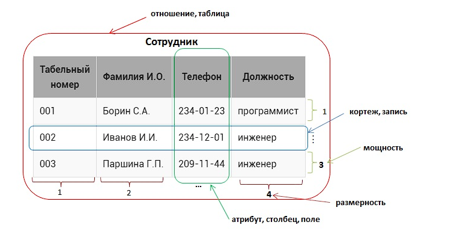

## Основные принципы реляционных баз данных

### [Ссылка на урок](https://stepik.org/lesson/297508/step/5?unit=279268)

1. все данные на концептуальном уровне представляются в виде объектов, заданных в виде строк и столбцов, называемых отношением, более распространенное название – таблица
2. в пересечение строки и столбца таблицы можно занести только одно значение
3. все операции выполняются над целыми отношениями и результатом этих операций является отношение

#### На примере таблицы рассмотрим терминалогию:
1. отношение это структура данных целиком, набор записец, сама таблица
2. атрибут – это столбец в таблице (более распространенный термин – поле ), в примере – Табельный номер, Фамилия И.О., Телефон, Должность
3. кортеж - кортеж – это каждая строка , содержащая данные (более распространенный термин – запись )
4. размерность - это число атрибутов в таблице, в нашем случае 4
5. мощность - это число котрежей (записей) в таблице
6. домен атрибута - допустимое значение, которое можно занести в поле

## Типы данных

### [Строковый тип данных](https://sql-academy.org/ru/guide/string-data-type)
### [Числовой тип данных](https://sql-academy.org/ru/guide/number-data-type)
### [Дата и время](https://sql-academy.org/ru/guide/datetime-data-type)

| Тип данных  |                             Описание                        |            Ограничения            |
|-------------|-------------------------------------------------------------|-----------------------------------|
| CHAR(X)     | фиксированная длина строки (полняется пробелами/обрезается) | X - принимает значения от 0 до 255 |
| VARCHAR(X)  | динамическая длина строки                                   | X - принимает значение от 0 до 65.535|
| BINARY(X)   | фиксированные двоичные строки                               | X - принимает значение от 0 до 255 |
| VARBINARY(X)| динамические двоичные строки                                | X - принимает значения от 0 до 65.535 |
||||
| BLOB        | двоичные строки. используется для хранения больших бинарных данных, таких как картинки | длина до 65.535|
| TINYBLOB    | | длина 255|
| MEDIUMBLOB  | | длина 16,777,215|
| LONGBLOB    | | длина 16,777,215|
||||
| TEXT        | текстовые строки. предназначен также для хранения больших данных, но текстового содержания| длина до 65.535 |
| TINYTEXT    | | длина 255|
| MEDIUMTEXT  | | длина 16,777,215|
| LONGTEXT    | | длина 4,294,967,295|
||||
| INT         | 4 байта. числовой тип данных. предназначен для хранения целочисленных данных | от $-2^{31}$ до $2^{31} - 1$, от 0 до $2^{32} - 1$ |
| TINYINT     | 1 байт  | от -128 до 127 (от $-2^7$ до $2^7-1$), от 0 до 255 (от 0 до $2^{8}-1$) |
| SMALLINT    | 2 байта | от -32768 до 32767 (от $-2^{15}$ до $2^{15}-1$), от 0 до 65535 (от 0 до $2^{16}-1$)|
| MEDIUMINT   | 3 байта | от $-2^{23}$ до $2^{23}-1$, от 0 до $2^{24}-1$|
| BIGINT      | 8 байт  | от $-2^{63}$ до $2^{63}-1$ от 0 до $2^{64}-1$|
| DECIMAL(M,D)| хранит точное вещественное значение данных. Он используется, когда точность является критически важной||
| BIT         | M бит   | от 1 до 64 бит|
| BOOL        | 1 бит   | либо 1, либо 0|
||||
| DATE        | 3 байта. Хранит дату в формате ГГГГ-ММ-ДД                         | от 1000-01-01 до 9999-12-31|
| TIME        | 3 байта. Хранит время в формат ЧЧ[Ч]:ММ:СС                        | от -838:59:59 до 838:59:59|
| DATETIME    | 8 байт. Хранит дату и время в формате ГГГГ-MM-ДД ЧЧ:ММ:СС         | от 1000-01-01 00:00:00 до 9999-12-31 23:59:59|
| TIMESTAMP   | 4 байта. Хранит значение даты и времени в виде ГГГГ-MM-ДД ЧЧ:ММ:СС| от 1970-01-01 00:00:01 до 2038-01-19 03:14:07|