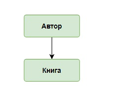
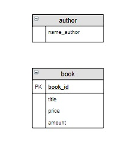
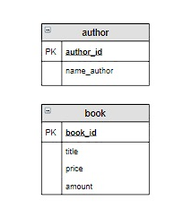
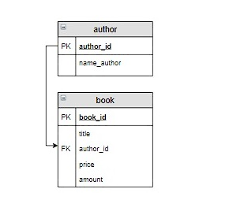
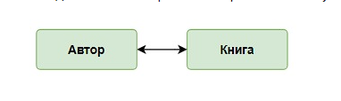
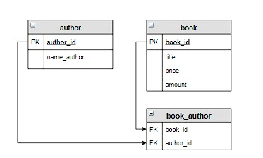
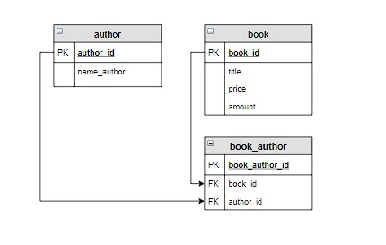

### [Ссылка на урок](https://stepik.org/lesson/308885/step/)

### Связь «один ко многим»

Связь «один ко многим» имеет место, когда одной записи главной таблицы соответствует несколько записей связанной таблицы, а каждой записи связанной таблицы соответствует только одна запись главной таблицы.

Этапы реализации связи «один ко многим»
Пример:
Один автор может написать несколько книг, а одна книга написана только одним автором. Для каждой книги известны ее количество и цена.

1. Создать таблицу author, в которую включить всех уникальных авторов книг

2. Обе таблицы должны содержать первичный ключ, в таблице book - это book_id; а в таблице author - это author_id

3. Включить в таблицу book связанный столбец (внешний ключ, FOREIGN KEY), соответствующий по имени и типу ключевому столбцу главной таблицы (в нашем случае это столбец author_id)

### Связь «многие ко многим»
Для соединения таких таблиц используется связь «многие ко многим».

Связь «многие ко многим» имеет место когда каждой записи одной таблицы соответствует несколько записей во второй, и наоборот, каждой записи второй таблицы соответствует несколько записей в первой

Этапы соединение таблица типом многие-ко-многим

3. Создать новую таблицу-связку, состоящую из двух столбцов, соответствующих по имени и типу ключевым столбцам исходных таблиц. Каждый из этих столбцов является внешним ключом (FOREIGN KEY)  и связан с ключевым столбцом каждой таблицы

4. Дальше необходимо определиться с первичным ключом таблицы-связки. Можно сделать два ключевых столбца, тогда все записи в этой таблице должны быть уникальными, то есть не повторяться. Для связи автор-книга этот вариант подходит. Но в некоторых случаях записи в таблице-связке могут повторяться, например, если мы будем продавать книги покупателям (один человек может купить несколько книг, а одну и ту же книгу могут купить несколько человек). Тогда в таблицу-связку включают дополнительные столбцы для идентификации записей, например, дату продажи,  также в таблицу-связку добавляют первичный ключ

